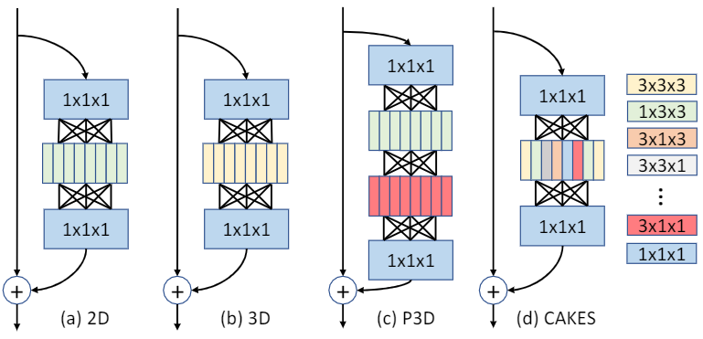

# CAKES: Channel-wise Automatic KErnel Shrinking for Efficient 3D Networks

## Introduction
<div align="center">
  
</div>


This repository contains the code for paper [CAKES: Channel-wise Automatic KErnel Shrinking for Efficient 3D Networks](https://arxiv.org/abs/2003.12798). In this paper, we propose CAKES as an efficient alternative to 3D convolution. The key principle is to simpliy a 3D convolution layer at channel-level. Each 3D kernel is replaced by its efficient sub-kernel, enbaling operations deployed in every layer to be heterogeneous, so that they can extract diverse and complementary information to benefit the learning process. It also allows a more general and flexible replacement design to generlize to both spatial-temporal and volumetreic data. Furthermore, we propose a new search space based on CAKES, so that the replacement configuration can be determined automatically. Experiments show that CAKES could obtain a better accuracy-cost trade-off compared to other operations.


## Dependencies:

The code is tested under enviroment with TITAN RTX, CUDA 10.1, PyTorch 1.0

## Dataset:

Please refer to [TRN](https://github.com/zhoubolei/TRN-pytorch) for data preparation on Something-Something dataset.

## Model Zoo:
  |                              | Top-1 | Top-5 |
  |------------------------------| -------------| -------------|
  |CAKES<sup>C</sup><sub>1,2D</sub> 8 frame       | 46.8     |  76.0    |
  |CAKES<sup>P</sup><sub>2,3D</sub> 8 frame       | 47.4     |  76.1    |
  |CAKES<sup>P</sup><sub>1,2,3D</sub> 8 frame  | 47.2    |  75.7    |
  |CAKES<sup>C</sup><sub>1,2D</sub> 8 frame       | 48.0     |  78.0    |
  |CAKES<sup>P</sup><sub>2,3D</sub> 8 frame       | 48.6     |  78.6    |
  |CAKES<sup>P</sup><sub>1,2,3D</sub> 8 frame  | 49.4    |  78.4    |
  
 * results are reported based on center crop  and 1 clip sampling. 

### Searching
Please refer to the following commands for searching CAKES. We use 8 GPUs to construct all experiments.
#### CAKES<sup>C</sup><sub>1,2D</sub>
```
CUDA_VISIBLE_DEVICES=0,1,2,3,4,5,6,7 python main.py --root_path PATH_TO_DATASET --dataset somethingv1 --checkpoint_dir PATH_TO_SAVE_CKPT --type I3D --arch resnet50 --num_segments 8 -b 96 --lr 0.04 --op_code conv1_2d -sr --s 0.0001 --search --reweight
```
#### CAKES<sup>P</sup><sub>1,2D</sub>
```
CUDA_VISIBLE_DEVICES=0,1,2,3,4,5,6,7 python main.py --root_path PATH_TO_DATASET --dataset somethingv1 --checkpoint_dir PATH_TO_SAVE_CKPT --type I3D --arch resnet50 --num_segments 8 -b 96 --lr 0.04 --search --op_code conv1_2d_dropout --epochs 140 --lr_steps 100 120
```
#### CAKES<sup>C</sup><sub>2,3D</sub>
```
CUDA_VISIBLE_DEVICES=0,1,2,3,4,5,6,7 python main.py --root_path PATH_TO_DATASET --dataset somethingv1 --checkpoint_dir PATH_TO_SAVE_CKPT --type I3D --arch resnet50 --num_segments 8 -b 96 --lr 0.04 --op_code convst -sr --s 0.0001 --search --reweight
```
#### CAKES<sup>P</sup><sub>2,3D</sub>
```
CUDA_VISIBLE_DEVICES=0,1,2,3,4,5,6,7 python main.py --root_path PATH_TO_DATASET --dataset somethingv1 --checkpoint_dir PATH_TO_SAVE_CKPT --type I3D --arch resnet50 --num_segments 8 -b 96 --lr 0.04 --search --op_code convst_dropout --epochs 140 --lr_steps 100 120
```
#### CAKES<sup>C</sup><sub>1,2,3D</sub>
```
CUDA_VISIBLE_DEVICES=0,1,2,3,4,5,6,7 python main.py --root_path PATH_TO_DATASET --dataset somethingv1 --checkpoint_dir PATH_TO_SAVE_CKPT --type I3D --arch resnet50 --num_segments 8 -b 96 --lr 0.04 --op_code conv1_2_3d -sr --s 0.0001 --search --reweight
```
#### CAKES<sup>P</sup><sub>1,2,3D</sub>
```
CUDA_VISIBLE_DEVICES=0,1,2,3,4,5,6,7 python main.py --root_path PATH_TO_DATASET --dataset somethingv1 --checkpoint_dir PATH_TO_SAVE_CKPT --type I3D --arch resnet50 --num_segments 8 -b 96 --lr 0.04 --search --op_code conv1_2_3d_dropout --epochs 140 --lr_steps 100 120
```

After the searching finishes, use the following command to obtain the replacement configuration:
```
python main.py --root_path PATH_TO_DATASET --dataset somethingv1 --checkpoint_dir PATH_TO_SAVE_CKPT --type I3D --arch resnet50 --num_segments 8 -b 96 --lr 0.04 --op_code conv1_2_3d -sr --s 0.0001 --search  --prune --prune_model_path PATH_TO_SEARCH_CKPT
```
The configuration will be saved to ./conv_config.txt, and you can copy it to config.py where all configurations are saved in a dictionary.

### Training
Please refer to the following commands for training and evaluating the searched networks. We use 8 GPUs to construct all experiments. You can choose OP_CODE among conv1_2d, convst, conv1_2_3d. CONV_CONFIG refers to the key in dictionary saved in config.py
```
CUDA_VISIBLE_DEVICES=0,1,2,3,4,5,6,7 python main.py --root_path PATH_TO_DATASET --dataset somethingv1 --checkpoint_dir PATH_TO_SAVE_CKPT --type I3D --arch resnet50 --num_segments 8 -b 96 --lr 0.04 --op_code OP_CODE --conv_config CONV_CONFIG
```

### Testing
You can test CAKES with the provided checkpoints using following commands:

#### 8frame
Testing Results: Prec@1 47.240 Prec@5 75.673 Loss 2.39457

```CUDA_VISIBLE_DEVICES=0,1,2,3,4,5,6,7 python main.py --root_path PATH_TO_DATASET --dataset somethingv1 --checkpoint_dir PATH_TO_SAVE_CKPT --type I3D --arch resnet50 --num_segments 8 -b 96 --lr 0.04 --op_code conv1_2_3d --conv_config CAKES123D_P --resume ./ckpt/8frame_CAKES123D_PerformancePriority.tar --evaluate```

#### 16frame
Testing Results: Prec@1 49.410 Prec@5 78.363 Loss 2.27473

```CUDA_VISIBLE_DEVICES=0,1,2,3,4,5,6,7 python main.py --root_path PATH_TO_DATASET --dataset somethingv1 --checkpoint_dir PATH_TO_SAVE_CKPT --type I3D --arch resnet50 --num_segments 16 -b 96 --lr 0.04 --op_code conv1_2_3d --conv_config CAKES123D_P --resume ./ckpt/16frame_CAKES123D_PerformancePriority.tar --evaluate```


## Citation
If you find this work or code useful for your research, please use the following BibTex entry:
```
@article{yu2020cakes,
  title={CAKES: Channel-wise Automatic KErnel Shrinking for Efficient 3D Network},
  author={Yu, Qihang and Li, Yingwei and Mei, Jieru and Zhou, Yuyin and Yuille, Alan L},
  journal={arXiv preprint arXiv:2003.12798},
  year={2020}
}
```

## Acknowledgements:
This codebase is build upon [TRN](https://github.com/zhoubolei/TRN-pytorch), [TSN](https://github.com/yjxiong/tsn-pytorch) and [GST](https://github.com/chenxuluo/GST-video).